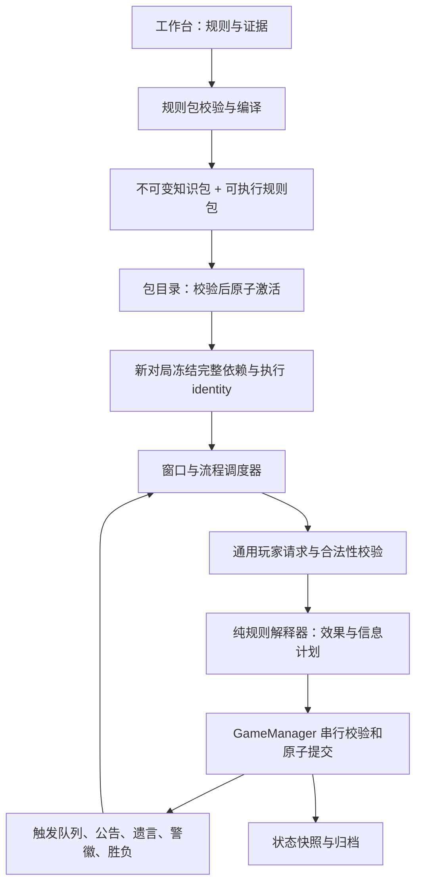

# 板子技能热插拔改造评估与技术方案

- 评估日期：2026-10-01。
- 源码基线：`f0ba661`，评估开始时工作区无改动。
- 文档性质：架构提案与工程估算；本文描述的新模块、schema 和命令尚未实现。
- 范围确认：新增板子或技能只修改规则配置，新对局生效；不新增角色、技能或插件实现代码。
- 复审结论：方向可行，可开始语义设计和最小闭环验证；尚不能凭本文承诺任意板子全覆盖或直接冻结完整平台实现。开发准入条件见第 12 节。
- 决策依据：现有 `doc/` 技术方案、知识库设计、老板子实现说明及实际源码；有差异时，本文明确区分设计目标与已实现行为。

## 1. 结论与建议

目标是把项目改成“新增板子或技能只修改板子/知识库中的规则配置，新对局加载后即可执行”，包括此前没有命名或单独实现过的新技能。现有知识库、冻结快照、玩家协议和原子提交基础可以继续使用。

但当前项目还不具备通用技能执行能力。改造重点是建立**可执行规则层**：技能条件、窗口调度、技能效果、跨技能交互、触发队列和胜负判断，都必须有机器可执行的定义。增加 YAML 字段或让模型阅读更多角色文档，不能自动实现技能结算。

采用“声明式技能定义 + 通用规则解释器”的方案：

1. 技能统一表达为发动条件、发动目标、发动时间、发动效果和结果公开策略；引擎按这些定义执行，不按角色或技能名称分支。
2. 一次性实现通用条件、选择器、状态操作、效果组合与流程能力。后续新增技能的交付物只有配置、规则说明和声明式验收场景，不编写 Python/TypeScript 技能代码或代码插件。
3. 服务加载新包后，新对局可选用新版本；进行中的对局保留自己的冻结包。
4. 当前对局保持冻结版本；局中技能替换不属于本次需求。

初步估算如下，均指一次性框架建设，包含相应测试与文档，不代表任意数量板子的内容制作已包含在内。

| 目标 | 工程工作量 | 预期结果 |
| --- | --- | --- |
| 第一阶段验证 | 12–20 人日 | 老板子迁移到通用结算；选定规则的守卫技能可通过配置运行，验证包加载和版本隔离 |
| 配置驱动技能平台，包含第一阶段 | 50–80 人日 | 通用条件/目标/时间/效果/公开策略，以及白天技能、触发链、状态关系、包版本隔离 |

上述是基于静态阅读和现有基线验证的预算区间，不是已证明完整覆盖的交付报价，置信度偏低至中等。现有测试验证的是旧引擎，不是拟议 DSL。语义原型和第一阶段完成后应按真实实现重新估算。若由两名熟悉项目的工程师实施，整体平台暂估 6–10 个日历周；一人约 10–16 个工作周。依赖顺序、规则确认和评审会影响周期。

## 2. 已确认的热插拔定义

| 内容 | 新增时需要做什么 | 是否属于本次目标 |
| --- | --- | --- |
| 新板子 | 配置人数、身份组合、技能绑定、流程和胜负规则 | 是，纯配置 |
| 新技能 | 配置条件、目标、时间、效果和公开策略，可包含状态、历史和跨技能交互 | 是，纯配置；不要求该技能此前有单独实现 |
| 新规则版本 | 校验并发布新的规则包，新对局选用 | 是，原对局继续旧版本 |
| 独立代码插件 | 编写实现新技能或新算子的代码 | 否，不作为配置驱动的替代方案 |
| 局中替换 | 修改正在运行对局的技能和已有状态 | 否，本次不需要 |

规则语言应支持有类型的变量、集合、条件组合、历史状态和效果组合，而非把现有角色换成固定技能模板菜单。板子目录用于验证抽象覆盖是否充分，不作为每个板子单独开发技能的清单。零代码承诺适用于冻结的状态类型、原语和流程契约能表达的技能空间；此前没有名字的新技能也可以落在这个空间内。不能由“技能能归入五项描述”推导出“有限引擎永久支持任何未来玩法”。

如果一个目标技能仍要求增加专用代码，说明通用模型没有完成覆盖，应作为框架建设阶段的设计缺口处理，不能把“再写一个插件”当作满足本次需求。规则维护者仍需编写结构化配置；只有自然语言描述不足以获得确定、可校验的执行语义。

### 2.1 五个维度与通用执行能力的对应

| 用户定义 | 配置表达 | 通用执行示例 |
| --- | --- | --- |
| 发动条件 | 当前状态、历史选择、次数/资源、触发事实的组合条件 | 存活且药未用；目标不同于上一夜；死因为狼刀时触发 |
| 发动目标 | 选择集合、数量、顺序、过滤与关联关系 | 一名他人；两名玩家；关系绑定的玩家 |
| 发动时间 | 阶段 hook、事件 hook、前置依赖、持续与失效边界 | 每夜选择；死亡后选择；放逐前自动替代 |
| 发动效果 | 对状态/关系/资源/信息/流程的有类型操作与条件组合 | 建立保护；产生死亡意图；绑定关系；查验；改变身份；结束当前发言段 |
| 结果是否公开 | 接收者、可见字段、披露时机 | 仅本人知道查验；狼队共享；次日公告死亡 |

次数和历史属于发动条件及其所需状态；保护、连带死亡和技能替代属于效果及其组合规则。它们都由同一配置模型表达，不要求额外维护角色专用实现。公开策略需要比一个布尔值更丰富，以区分本人、团队、全体和延迟公开。

## 3. 当前项目已具备的基础

### 3.1 可以复用的部分

- `knowledge/package_loader.py` 已收集 board、role、mechanic、interaction 依赖闭包。
- `knowledge/compiler.py` 已产生确定性的编译包、有效角色配置和内容 identity。
- `knowledge/compiled_store.py`、`knowledge/snapshot.py`、`knowledge/runtime_loader.py` 已校验文件和 manifest，并支持自包含的对局知识快照。
- `game/setup.py` 已从角色定义授予能力和技能资源；角色 ID 主要采用字符串，不需要为每个新角色增加身份枚举。
- `game/actions.py` 已有动作注册表、窗口、目标约束、原子动作 bundle 和请求验证。
- `game/manager.py` 已有串行提交、revision 检查、资源扣除、幂等验证和整批夜间结算。
- `runtime/player_runtime.py`、Pi 协议和 Extension 已通过通用行动结构和知识查询支持玩家；`get_skill_status` 已有座位隔离。
- 投票、警长、遗言、消息路由及归档可作为平台公共能力保留。

这些模块有可复用基础，不意味着它们全部无需调整。动作注册表、执行计划、技能状态和版本 identity 必须进入同一冻结闭包。

### 3.2 已确认的执行层限制

下面路径均相对于 `src/werewolf/`，行号对应上述源码基线。

| 位置 | 实际行为 | 对热插拔的影响 |
| --- | --- | --- |
| `moderator/classic_resolution.py:44, 229` | 固定老板子 ID 与动作集合，按动作名称逐项结算 | 新板子无法直接复用自动结算 |
| `moderator/night_flow.py:216, 275` | 按已授予夜间能力生成窗口，单独处理狼刀协调者、女巫依赖；窗口动作数量固定为 1 | 窗口定义不够完整，多技能或新依赖需要改主持流程 |
| `moderator/night_flow.py:973` | pending/resolve 路径要求恰好一个夜间行动窗口与一个结算窗口 | 声明多个夜间行动窗口不等于完整闭环已支持 |
| `game/manager.py:626, 1271` | 单独识别 `SEER_INSPECT` 私密结果与 `WOLF_KILL` 刀口依赖 | 新查验、新信息技能仍需要专门代码 |
| `game/manager.py:5505, 5510` | 夜间拒绝自动死亡触发，拒绝同一结算产生多个选择型死亡触发 | 不能直接支持多死者触发与复杂技能链 |
| `game/state.py:428` | `pending_resolution` 是单个待处理记录 | 需要持久化触发队列和调度游标 |
| `knowledge/role.py:97, 113, 362` | 触发事件/效果是固定集合，`once=false` 被拒绝 | 被动监听、重复触发等不能仅靠配置扩展 |
| `knowledge/role.py:247, 393` | 能力效果主要记录 effect code、描述、可见性 | 描述尚未绑定到通用执行算子 |
| `knowledge/interaction.py:183` | 有谓词和有序 resolution step 结构，操作名称仍是逻辑字符串 | 有结构化交互知识，但未接入游戏层通用解释器 |
| `game/resolution.py:48` | 原子效果限于生死、死因、投票权/权重、资源五类 | 缺少状态、关系、身份/阵营、能力授予等效果 |
| `game/manager.py:942` | 效果校验主要检查类型、目标绑定和资源约束 | 通用执行路径还需要按动作/技能核验允许产生的效果及操作数 |
| `domain/enums.py:7`、`game/phase.py:35` | 固定阶段枚举和转换图 | 新的白天插入窗口、技能中断与恢复需要调度扩展 |
| `game/victory.py:251` | 只执行 `eliminate_side`，特殊条件通过既有别名解析 | 新阵营或新胜利条件无法任意配置执行 |
| `cli_support/play_setup.py:32, 118` | 固定候选板引用、工作台位置和 12 座位约束 | 便捷开局入口需要泛化 |
| `game/action_turn.py:97` 等 | 多处独立读取仓库全局 `config/actions.yaml` | 包版本冻结后，动作契约仍可能受外部文件变化影响 |

`EventType` 已允许合法的新事件名称；消息扩展的主要问题是安全 payload、披露条件和生成逻辑，不需要简单地把所有事件枚举推倒重做。

### 3.3 白狼王＋守卫是当前最有代表性的反例

项目已经有 `classic_12_white_wolf_guard@1.0.0` 候选知识包，动作注册表也有 `106 GUARD_PROTECT` 和 `107 SELF_SACRIFICE_TAKE`。

但 `tests/integration/test_white_wolf_guard_candidate.py` 验证的是加载、编译与动作契约，不是完整游戏执行。候选 `validation-report.md` 也明确写明：`this candidate does not add game reducer/action implementation`。

- 守卫的“禁止连续两夜守同一人”需要历史状态与谓词；目前该描述并不等于已有通用校验器。
- 守卫与解药、毒药的交互需要明确的最终死亡计算规则。
- 白狼王能力定义在 `DAY_SPEECH`，需要可打开的主动技能窗口、发言中断、两名目标死亡与后续触发，而不是猎人的死亡选择窗口。
- 自守、守救交互、白狼王带走目标后的技能等仍有人工待决项；引擎改造无法替代规则决策。

## 4. 目标架构



“知道规则”和“执行规则”分别编译，但属于同一个包闭包。Pi 读取的是同一冻结版本的公开说明和自身状态，主持器执行的是该版本对应的机器规则。

仅冻结同一个包不能保证描述和执行语义一致。编译后的有效规则是唯一执行依据，合并基础角色、共享能力及板子覆盖后，向主持器和玩家提供同一规则投影。公开能力摘要尽量从结构化规则生成；手写说明的语义一致性通过审核和场景验证，不能声称编译器能自动证明任意自然语言正确。

### 4.1 新增一个依赖方向清晰的执行模块

建议增加 `src/werewolf/rules/`；这是拟新增目录。

| 模块 | 职责 |
| --- | --- |
| `models.py` | 执行计划、谓词 AST、目标选择器、规则能力需求和版本 schema |
| `compiler.py` | 将知识定义与执行定义编译为有类型的计划，校验引用、效果和流程 |
| `predicates.py`、`selectors.py` | 执行受限条件和目标选择；独立于具体角色名称 |
| `interpreter.py`、`effects.py` | 根据只读观察计算候选效果、资源成本和披露计划 |
| `scheduler.py` | 依据窗口定义、依赖、调度游标生成请求；处理插入窗口和恢复点 |
| `triggers.py` | 匹配领域事实，维护稳定顺序的待处理触发队列 |
| `registry.py` | 发现规则包、校验执行能力与兼容版本、冻结版本实例 |
| `compat.py` | 显式将旧版包转换为兼容执行计划 |

模型/解释器依赖基础领域类型，不导入 `GameManager`；manager 组合解释器与提交能力。原有投票、警长模块继续作为平台流程组件，避免把成熟流程一次全部重写。

## 5. 可执行规则的最小模型

### 5.1 一个技能必须具有的执行语义

| 维度 | 需要表达的内容 |
| --- | --- |
| 身份与绑定 | skill ID、版本、角色授予、action code 与输入 schema |
| 何时可用 | 阶段、窗口 hook、主动/被动/选择触发、依赖事实 |
| 谁能发动 | 存活/死亡权限、阵营/团队关系、能力和资源状态 |
| 选谁 | 数量、顺序、自选/死者限制、历史目标、关系约束 |
| 次数与资源 | 全局次数、每回合次数、重置边界、扣费时机、失败/取消策略 |
| 产生什么 | 类型化效果、死亡意图、信息结果、后续触发事实 |
| 交互 | 替代、免疫、保护、同时生效、优先级与冲突规则 |
| 公开什么 | 披露时机、字段投影、接收者选择与快照观察点 |
| 怎样恢复 | 持久化状态、等待选择、return hook、幂等标识 |

不可继续让关键条件只存在于 `description`、`failure_rules.condition` 或 Markdown 正文中。保留这些说明供玩家阅读，但执行需要单独有类型的表达。

### 5.2 建议原语集合

- 条件：比较、集合成员、计数、状态存在、关系存在、资源阈值、当前回合/历史选择。
- 选择器：actor、action target、存活玩家、队友、指定阵营、当前死亡集合、关系关联者。
- 效果：伤害/死亡意图、保护、免疫、资源变化、状态增删、关系绑定/解除、投票资格/权重、信息结果。
- 第二阶段原语：变更身份/阵营、授予/撤销能力、复活、影响可见查验结果。
- 流程：打开选择窗口、延迟到结算边界、结束/恢复当前发言段、进入胜负检查。

原语集合需要固定版本，并具备组合、参数绑定、变量与集合运算能力。规则操作不能使用任意 Python 表达式、`eval` 或任意状态路径写入。框架建设时补齐目标机制所需的通用操作，后续技能用配置组合这些操作；不要注册角色专用 `guard_protect_handler` 或 `white_wolf_king_handler`。

### 5.3 守卫配置示意

以下是拟议 DSL，不是当前 role frontmatter 已支持的字段，不能直接复制进现有包运行。仅表达现有候选“禁止自守、禁止连续同目标”的变体，不把守救交互的待决项写成事实。

```yaml
schema_version: 2
skill_id: guard_protect
version: 1.0.0
action_code: 106
state:
  previous_target:
    type: nullable_seat
    initial: null
window:
  hook: night.choose
  mode: active
  eligible_actor: actor.alive
targets:
  min: 1
  max: 1
  selector: players.alive
  constraints:
    - op: not_equal
      left: target.seat
      right: actor.seat
    - op: not_equal
      left: target.seat
      right: skill_state.previous_target
usage:
  per_round: 1
  reset_at: night.start
on_plan:
  - op: emit_protection
    target: target.seat
    blocks_damage_tags: [wolf_attack]
    resolution_group: current_night
  - op: stage_skill_state
    key: previous_target
    value: target.seat
```

`on_plan` 在已冻结本组合法动作后生成临时保护意图和待提交的历史状态变化。保护只作用于当前结算组，在最终死亡计算前参与交互；历史状态在本组成功提交时写入。单纯接受 ActionRequest、计划失败或重试不产生重复历史记录。`wolf_attack` 是包中定义的伤害标签，通用引擎按标签匹配，不识别角色名称。首次无历史目标明确为 null，比较规则需定义 nullable 值语义。

保护与解药的组合、毒是否穿透保护等，应由单独的交互规则表达。语义冲突不能通过文件加载顺序默默决定。

## 6. 游戏执行路径怎样改

### 6.1 动作注册表随规则包冻结

保留 `actions[]` 的玩家线协议和旧 action code。把 `config/actions.yaml` 作为兼容基础输入，由编译器合并包级动作定义并校验冲突；新技能不要求修改仓库全局注册表。

`GameManager`、`ActionTurnScheduler`、night/trigger flow 和 publisher 使用同一个冻结 registry，停止各自读取磁盘默认值。未来如允许同动作多个能力授予，应增加 ability 实例绑定，避免仅凭 action code 取到第一个能力。

`TargetPolicy` 可以继续作为兼容快捷写法，新目标范围使用编译后的选择器/谓词。窗口数量、动作组合、目标 schema 和依赖也从包中生成，不固定 `max_actions=1`。

### 6.2 从具体动作分支变为执行计划

用 `RuleInterpreter` 替代 `build_classic_night_resolutions` 的动作名称分支。第一阶段输出仍可复用 `ActionResolution`，减少协议迁移范围；较复杂的交互最终需要一个覆盖多请求的 `ResolutionBatch`，含：

- 原始请求及每项的 disposition、消耗与对应技能实例。
- 类型化效果、信息披露计划与生成的领域事实。
- 读取的 revision、观察快照与执行包 identity。
- 规则 ID、交互 ID 和审计理由。

提交器必须检查生成效果是否在该技能允许的效果范围内，包括类型、目标集合和数值上限。当前人工裁定入口可保留为明确审计的 override，不把玩家响应当成裁定结果。

现有 `_validate_resolution_effect` 限制效果只能作用于动作目标，资源变化只能作用于 actor。这不能直接承载关系连带目标、队友资源授予等结果。新批协议需要为每个效果携带来源规则、能力实例、触发事实和计算出的授权对象范围，由提交器根据冻结规则重新核验；不能为了支持连带技能简单取消目标校验。

### 6.3 同时死亡与交互先计算，再统一提交

避免让效果依次修改 `alive` 来决定规则胜负。以同一份观察快照收集死亡意图、保护、治疗、免疫，按包声明的交互规则计算最终结果，再一次提交。

建议执行步骤：按窗口收集意图 → 固定组内观察与合法动作集合 → 构建临时效果集合 → 死亡/放逐前的替代或预防 → 应用交互 → 得到最终生死与 provenance → 提交 → 匹配死亡后的触发 → 收尾边界。死亡前替代如需玩家选择，则持久化待决计划并等待选择，选择完成后重新核验 revision 再提交；尚未确认的死亡不得提前公告或触发死亡后技能。不同板子的执行顺序应在类型化结算计划中表达。

同一观察只适用于同一个同时结算组，不意味着整夜所有窗口看到相同信息。女巫依赖已形成的刀口，需要显式的已接受请求事实及披露节点；查验需要声明读取原始身份、当前阵营还是规则计算的可见身份，以及读的是动作组快照还是某个已提交结果。资源检查同时区分动作收集、组内占用和结算扣费时点。

保留原子提交、base revision、幂等规则。稳定 ID 来自 game、round、window、request、skill instance 和 rule ID，不使用不可重放的随机数；时钟和随机源由宿主注入。

### 6.4 调度器支持多个窗口和白天技能

`NightWindow` 已有顺序和依赖基础，但需增加精确的能力/动作筛选、参与者、动作数量、上下文披露和结算分组。多窗口属于同一夜间结算组时，统一观察边界并合并完整请求集。

保留 `GamePhase` 作为粗粒度生命周期，增加包内字符串 hook、执行游标和持久化 return point。不要为每个角色增加新枚举。阶段图仍约束合法宏观转换；技能只能选择已声明、已支持的流程边。

白天主动技能第一版在每个发言座位之前/之后设置明确选择窗口，使用已有 `TurnRequest`。这个限制必须作为实验规则版本明确展示；它不能自动证明覆盖“任何白天时点发动”的正式变体。若目标变体需要别人正在发言时抢先发动，则需实现通用中断入口、优先级仲裁和 active turn 取消协议，再由配置控制，不能把轮询窗口冒充原规则。

### 6.5 单 pending 改为可恢复触发队列

拟增加 `pending_triggers[]`、当前 trigger 游标、已处理触发键与恢复 hook。每项绑定来源事实、角色能力实例、目标上下文和观察 revision。

- 自动触发和玩家选择触发走同一队列，后者暂停等待绑定请求。
- 顺序由包声明的规则优先级决定。同优先级只有在效果可交换，或规则明确允许固定 tie-break 时才能使用稳定次序；座位排序虽然确定，不等于规则正确。如规则没有定义必要优先级，编译拒绝或进入主持人待决。
- 使用 `(source_fact_id, ability_instance_id)` 去重，按技能声明处理 once/每回合次数。
- 每次选择及后续效果原子提交，派生触发追加到队列；队列耗尽后才恢复普通流程。
- 限制触发深度/执行步数，循环或冲突停在可审计边界，不静默丢弃技能。

公告、遗言、警徽和胜负必须保留现有顺序约束。禁止在触发链尚未完成时提前检查胜利。

### 6.6 通用状态与信息披露

增加按技能实例命名的 `skill_state`、按回合的 usage ledger、带期限的 status 和关系图。守卫历史目标、狼美人关系、禁言/封印、身份变化等使用这些状态，避免持续扩张 `PlayerState` 的角色专用字段。

通用信息原语生成结构化结果；宿主按配置中的白名单字段和接收者生成 `GameEvent`，不把完整权威状态当公共 payload。将预言家结果和女巫刀口特例迁移为信息计划，保留首夜未公告死亡等遮罩规则。

`get_skill_status` 和行动 prompt 根据同一有效能力实例生成，只呈现当前座位可见内容。授予/撤销能力与资源变化同步提交，身份/阵营变化还须更新团队权限、胜利分组和披露规则。

### 6.7 胜利条件编译为有类型谓词

用按阵营、胜利组、关系和状态统计的机器条件替换特殊条件字符串别名。保留旧 `eliminate_side` 作为兼容模板。

定义检查时机、多个同时候选的优先级、平局/共同获胜策略；未声明必要策略时不得猜测。变更身份/阵营后的胜利归属应由规则包明确规定，不能混用原角色分组与当前阵营。

## 7. 纯配置规则包的加载与版本隔离

### 7.1 包内容与 compatibility manifest

扩展现有编译产物，增加执行定义/计划、包级动作契约和能力需求。`compiled_store.py` 当前检查固定文件集合，新增文件必须配套升级 manifest、完整性校验、snapshot 和 archive 校验。

manifest 至少绑定：知识/执行 schema、编译器版本、引擎能力版本范围、规则包 digest、动作 registry digest、执行计划 digest、技能状态 schema。规则包只包含声明式数据及说明，不加载 Python/TypeScript 可执行模块。

### 7.2 生命周期

`发现 → 暂存 → schema/依赖/能力/场景校验 → 编译 → 原子激活 → 新对局可选 → 最后一局释放后可卸载`。

- 默认加载显式包目录；可加 refresh 命令，文件监视只提示发现变更，不直接将未完成的文件替换为活动版本。
- 当前版本指针只影响新对局。升级失败保留上一活动版本，坏包不产生半生效 registry。
- 对局冻结具体版本及全部制品，拒绝隐式 `latest`。
- 旧对局持有引用时不能删除其规则包/执行计划；下架只阻止新局引用，保留旧局恢复所需版本。
- 恢复旧对局必须找到完全匹配的 execution identity；缺失版本明确失败，不能用新规则“尽量恢复”。

规则包同时携带技能定义、交互定义、公开说明与声明式场景数据。所有包使用同一个解释器，版本变化体现为数据变化，不涉及导入新代码或 Python 模块热重载。

### 7.3 配置执行边界

解释器只读取绑定本局版本的规则及宿主提供的观察，输出类型化候选计划。所有权威状态变化通过 GameManager 校验与提交；公开消息按结果投影生成。配置不能绕过目标授权、资源校验、原子提交和信息隔离。

编译器必须拒绝未定义操作、类型不匹配、非法引用、无规则依据的优先级和可能造成无界执行的配置。复杂技能用条件、状态、集合和效果组合表达，不通过任意 callback 逃逸到角色专用代码。

终止性通过受限语法保证：不允许任意递归或无界循环，集合遍历只操作有限、已绑定的快照集合。事件触发循环不声称能全部静态判定，运行时增加预算和因果去重；超过预算暂停并报告错误，不截断后继续判胜。静态校验也不能穷举证明全部技能组合正确，必须结合声明式场景与运行时断言。

### 7.4 新版本生效时机

发布后更新新局可选版本目录；创建对局时冻结该版本及依赖。已有对局不会重新读取活动目录或接受技能替换，因此不需要局中资源迁移、请求取消、session 重建或已披露信息处理。本次预算不含这些工作。

## 8. 具体改动范围与工作量

### 8.1 预计涉及的文件

当前 Git 跟踪下生产 Python 为 102 个文件、50,254 行；测试为 103 个文件、26,678 行。规模统计包含导出与模型样板，不能用总代码行数直接推算工期。

| 区域 | 主要已有文件 | 改动方式 |
| --- | --- | --- |
| 执行内核 | 拟新增 `rules/` | 新增约 7–11 个模块；定义通用编译器、解释器、原语、调度与规则包接口 |
| 知识与发布 | `knowledge/{role,board,interaction,mechanic,compiler,compiled_store,runtime_loader,package_loader,publisher,snapshot,action_contract}.py` | schema/执行绑定、能力覆盖、包完整性和旧版本兼容 |
| 权威状态与提交 | `game/{state,manager,actions,resolution,events,setup,phase,victory}.py` | 类型化扩展状态、执行身份、效果校验与批提交、触发队列 |
| 调度与主持 | `game/{night,day,day_resolution,action_turn}.py`、`moderator/{night_flow,trigger_flow,classic_resolution,play_runner,shell,config}.py` | 移除专用自动裁定、接入通用计划和白天技能窗口 |
| 玩家与 CLI | `runtime/{player_runtime,prompt_composer,demo_runtime}.py`、`knowledge/skill_status.py`、`cli_support/play_setup.py`、`cli.py` | 当前能力/候选目标投影、通用板子开局、包刷新入口 |
| 持久化 | `persistence/{snapshot,archive}.py` | 状态/制品版本兼容、触发恢复、归档执行身份 |
| 规则内容 | `vault/_workbench/` 的新版本草稿 | 迁移老板子及守卫/白狼王验证包；通过编译发布生成，不手改 compiled |
| 测试与示例 | `tests/{unit,contract,integration,scenarios}/`、`config/`、`doc/` | 新旧行为等价、包生命周期、交互和秘密隔离验收 |

按最终功能裁剪，预计修改约 30–45 个已有生产文件，新增约 7–11 个生产文件；新增或调整约 20–35 个测试文件。上表是候选影响面，列举文件数可能超过实际修改数。

生产逻辑新增约 5,000–9,000 行，已有逻辑调整约 2,000–4,000 行，测试新增/调整约 3,000–6,000 行。三项口径不同，调整行数会与新增/替换部分交叉，不相加当作 diff 总量；不包含批量规则内容。行数是规划量级，不是交付指标。

### 8.2 50–80 人日的分解

| 工作项 | 人日 | 交付物 |
| --- | --- | --- |
| 五维模型、可组合 DSL/schema 与兼容设计 | 6–9 | 变量/集合/状态/效果组合和旧包转换约定 |
| 执行编译、动作冻结、publish 能力校验 | 6–10 | 启动前发现不支持的技能与交互 |
| 解释器、交互计算、效果批提交和信息计划 | 8–12 | 独立于板子 ID 的确定性裁定 |
| 多窗口、白天主动技能、插入与恢复 | 7–10 | 泛化的窗口与流程调度 |
| 触发队列、状态/关系和计数 | 5–8 | 多触发及跨回合技能闭环 |
| 规则包发现、版本并存、发布与下架 | 3–5 | 新对局加载新数据版本，已有对局版本隔离 |
| 胜负、身份/能力变化与公共机制接入 | 4–6 | 复杂板子执行支持 |
| CLI、运行时投影、快照与归档兼容 | 4–6 | 可开局、可查询、可恢复的完整入口 |
| 差分验证、代表性场景、整局回归与文档 | 7–14 | 可重复验收和迁移说明 |
| **合计** | **50–80** | **一次性框架建设** |

澄清范围后暂保留 50–80 人日粗估：删除原生插件建设，将相应设计预算转向更完整的可组合规则语言。这不是新增技能的逐个代码开发预算。第一阶段验证抽象后需重新核算，不能仅按“去掉插件”推算整体大幅缩短。

不包含：无限量新板子的来源调研和人工规则决议、Web/TUI、代码插件、真实 LLM 费用与 provider 集成、任意时点异步抢先发动和局中规则迁移。

平台完成后，简单新板预计 0.5–2 人日用于规则配置与声明式场景校验；复杂交互板预计 2–5 人日。均不包含新增技能实现代码。若必须添加技能专用代码，该板不得标记为满足本次热插拔验收。

## 9. 分阶段实施与退出条件

### 阶段 A：12–20 人日，验证配置驱动的最小闭环

- 前 4–6 人日先完成第 12 节的语义契约及纸面规则/原型验证，计入本阶段，不另加预算。验证未通过时调整设计和估算，不先铺开整个框架。
- 固定 DSL v1、冻结 registry/执行 identity，建立类型化编译和解释执行入口。
- 将老板子夜间与触发裁定迁移到通用计划；用旧裁定器做迁移期差分 oracle。
- 在明确的守卫规则变体下实现历史目标、保护与已确认的交互。
- 泛化开局板子引用和包加载入口，建立新局/旧局版本隔离。

退出条件：老板子行为保持等价；守卫变体及一个开发前未命名的新组合技能只改 workbench/包数据即可运行；旧对局在目录刷新后继续原版本。新组合技能须改变条件、目标数量、时间或结果投影，证明不是只把既有技能模板参数化。第一阶段验证抽象，不代表完整目标已经交付。

### 阶段 B：18–28 人日，复杂技能闭环

- 多夜间窗口与依赖、白天主动窗口和恢复点。
- 多级触发队列、状态/关系、身份/阵营/能力变化和通用信息结果。
- 用已明确规则的白狼王、连带关系技能及查验变体覆盖关键机制。

退出条件：白狼王通过配置发动并正确中断/恢复流程；多名死者及连带触发不丢失；技能资源与使用次数在重试/恢复后保持一致。

### 阶段 C：20–32 人日，平台化交付

- 纯配置包版本并存与引用生命周期、能力门禁、旧包兼容及恢复。
- 通用胜利、发布场景校验、完整 CLI 与归档执行身份。
- 完成目标板子目录与规则覆盖矩阵，按矩阵声明零代码支持范围。

退出条件：加载一个此前不存在的板子包及新组合技能，只修改规则配置和声明式验收数据，不改 `src/`、`extensions/`、仓库全局动作定义，也不添加代码插件，即可完成开局、技能结算、胜负与归档；缺能力的包启动前失败且登记为框架覆盖缺口；运行中的局保持原版本。三阶段区间相加为 50–80 人日，与上一节按模块分解是同一预算，不能重复计费。

## 10. 验收矩阵与迁移策略

| 类别 | 必须验证的行为 |
| --- | --- |
| 零代码验收 | 对未知 board/skill ID 加载纯数据包；更改五个维度可生成新技能；无角色名称专用分支、无新增代码插件；新增动作从包进入冻结 registry |
| 老板子回归 | 女巫药剂限制、毒猎人、白痴放逐、首夜死亡遮罩、警长/遗言/PK/屠边保持冻结规则 |
| 同时结算 | 同目标狼刀/药/保护、多死因及冲突规则；同一观察快照产生唯一确定结果 |
| 触发链 | 多名死者、自动/选择混合、连带死亡、PASS、队列去重、环路与边界恢复 |
| 白天技能 | 发言边界合法窗口、失效角色不能发动、中断/恢复、后续触发与胜利检查 |
| 资源与状态 | 每轮/总次数、历史目标、过期状态、关系、身份变化和技能授予/撤销 |
| 权限 | 玩家伪造目标/效果、过期 session/请求、信息投影、未公告死亡和私密频道隔离 |
| 包生命周期 | 新旧版本并存、加载失败回滚、活动对局引用、下架、执行语言/状态 schema 不兼容 |
| 快照与归档 | 缺制品、篡改 digest、旧版本恢复、未完成触发、执行 identity 与状态一致 |

迁移时先保持玩家动作协议和粗粒度 phase 稳定，通过显式兼容编译把旧知识包映射到执行计划。修改 schema_version 后同步调整 strict key 校验和固定文件清单；不能只改 `RoleDefinition` 而让旧 loader 静默忽略新字段。

测试优先复用现有 unit/contract/integration/scenarios；新增针对机制、授权和迁移边界的测试，避免给每个 YAML 字段写无行为意义的镜像测试。原有实现只在迁移期作为 oracle，完成等价验证后自动执行入口统一走新内核。

## 11. 本次开发环境配置与实测证据

### 11.1 已完成环境工作

- uv：`0.12.19`；Python：`3.11.16`；项目虚拟环境：`.venv/`。
- 保留 `.python-version`、`pyproject.toml` 和 `uv.lock` 原样。
- 当前网络策略无法访问锁文件的清华镜像；导出临时 `pylock.toml`，仅将制品地址切换为允许的 `files.pythonhosted.org`，通过 `uv pip sync --require-hashes` 安装原版本、原哈希制品；项目采用 editable 安装。
- 安装脚本已复跑成功；`uv pip check` 确认 35 个已安装包兼容。
- 环境配置草稿已保存 `install_script`、`start_skill`，以及镜像域名允许列表更新。保存草稿不等于网络已生效或环境已发布。
- 当前直接使用 `uv run --no-sync ...`，避免普通命令在构建隔离阶段重新访问被阻止的镜像。镜像配置应用后须重新验证标准 `uv sync --locked`。

### 11.2 基线检查结果

| 检查 | 本次结果 |
| --- | --- |
| CLI help、示例配置校验、老板子规则闭包校验 | 通过 |
| `uv run --no-sync pytest -q` | 1036 passed、6 skipped、1 failed、1 warning |
| `uv run --no-sync ruff check .` | 通过 |
| `uv run --no-sync ruff format --check .` | 251 files 已格式化，通过 |
| `uv run --no-sync mypy src`，Linux 目标 | 5 个错误，均为 `runtime/pi_process.py` 的 Windows ctypes 属性 |
| `uv run --no-sync mypy --platform win32 src` | 102 个生产文件通过；不替代 Linux 检查结果 |
| 12 座位完整脚本对局 | 成功退出；344 行输出、stderr 0 bytes，最终 `FINISHED/CLOSED`，round 4/day 4，winner=wolf |
| 完整对局归档校验 | `status=valid`，86 个文件；manifest、hash 与 schema 校验通过 |
| 规则编译、动作契约、夜间与猎人触发针对性测试 | 24 passed |

唯一测试失败已单独复现：`tests/integration/test_workbench_artifact_store.py:153` 要求异常文本包含 `canonical`，而 `artifact_store.py:357` 正确拒绝篡改后返回 `artifact manifest does not match the completed bundle`。这属于现有错误信息断言不一致，不是依赖安装失败；本次未修改源代码或测试。

Linux 类型检查问题来自 WinDLL/get_last_error 的平台类型定义；现有运行代码含 `os.name` 判断。Windows 目标检查通过只说明其目标类型声明一致，不证明 Windows 运行时在此环境已执行。

脚本对局结果保存在忽略目录 `.runtime/cloud-env-smoke-20261001/`；归档为 `games/archive/20261001T135017Z_classic-play-001/`。没有启动真实 Pi/provider，不将离线验证当作真实模型或所有技能触发覆盖。

本文仅交付技术方案与评估，尚未实现新的通用规则内核或修改候选包的正式审核状态。

## 12. 开发前复审：可行性、逻辑缺口与准入条件

### 12.1 审查结论

**五维抽象方向成立，但五个字段本身还不是完整执行模型。** 必须把条件定义为有类型表达式，把效果定义为对通用状态和领域事实的组合操作，把时间定义为有先后关系、可等待选择的流程。只有这样，开发前未出现过的新组合技能才能通过配置获得确定行为。

目前可以启动语义设计与最小闭环原型；不能把现有旧引擎测试通过、配置编译通过或这份文档当作“全部板子纯配置执行已验证”。本文已有架构和影响面，但还需在阶段 A 前段冻结以下执行契约与反例结果，才适合全面实现。

### 12.2 本次发现的关键问题

| 级别 | 问题与反例 | 必须采取的修正 |
| --- | --- | --- |
| P0，全面实现前必须解决 | “效果可以不同”不等于引擎能执行未知效果。例如守卫不能最终结算后才令目标复活，白痴也不能先按放逐死亡触发猎人式后置流程再恢复存活 | 引入候选效果、死亡前替代、最终死亡事实和死亡后触发，禁止任意顺序的直接字段覆盖 |
| P0 | 狼刀、保护、解药单独都有完整技能定义，组合后仍可能需要“守救同时命中”的独立变体规则 | 同一规则包包含板子级交互计划；声明冲突、替代和多死因处理，不能仅按技能文件顺序执行 |
| P0 | “发动时间=夜间”不足以决定女巫何时知道刀口、查验读的是变化前还是变化后的阵营 | 显式窗口依赖、观察快照/临时事实读取范围、结果披露节点；同一结算组同时观察与跨窗口信息推进分开 |
| P0 | “发动条件”依赖上夜目标、封印、死亡来源、能力是否已撤销等事实；只有最终字段而无历史及来源就不能判断 | 定义有类型的技能状态、关系、使用账本、带来源的领域事实及其生命周期 |
| P0 | 现有提交器禁止效果作用于未选目标，且只允许 actor 资源变化；连带死亡和资源赠予会被拒绝 | 升级带来源与派生授权的批效果契约；保留宿主校验，不简单放开写任意玩家 |
| P1，相关机制实现前必须解决 | 新技能可能不是选一个座位，而是选择类型/模式、确认后再次选人、多人共同选择或需要中断当前发言 | 使用通用决策节点和类型化参数 schema；定义窗口关闭、超时、重试及取消。发言前后轮询不能冒充任意时点发动 |
| P1 | 公开/不公开的布尔值无法表达本人/团队/全体、立即/次日、部分字段；查验对象可能有伪装身份 | 结果计算与披露分离，分别定义结果语义、接收者、字段与时点；避免候选目标/拒绝理由泄露隐藏身份 |
| P1 | 现有 `game/setup.py` 从 `profile.base_role` 复制能力，文件注释明确不解释 `effective_rules`；特殊狼人只有自身角色技能也不自动等于拥有队伍共同行动 | 在编译阶段合成唯一有效能力集合，支持角色/队伍/公共机制的共享授予和类型化板子覆盖；主持器与玩家查询同一份合成结果 |

P0/P1 是本方案的设计依赖分级，不代表用户需要额外批准。源码已验证的限制与拟议规则的逻辑反例在表中分别陈述；没有把未决规则猜测成正式规则。

五个维度仍可保留为技能编写入口，以上能力是这五个维度背后的执行语义。板子整体另外包含组成、流程、交互、共享能力、投票与胜负契约，不能试图让每个角色技能独自承担整套板子规则。

### 12.3 开发前需要冻结的七个契约

| 契约 | 最小内容 | 默认方向 |
| --- | --- | --- |
| `RuleStateSchema` | 玩家/阵营/胜利组/聊天组、资源、状态实例、关系边、技能局部状态与使用账本的类型/期限 | 允许配置声明状态、关系和资源类型，拒绝访问未声明路径；空历史值有明确 null 语义 |
| `SkillSpec` | stable skill ID、五维表达、输入参数、主动/自动/选择模式、共享授予与覆盖 | skill ID/action code 是数据身份；不触发名称对应的 Python 分支 |
| `DecisionNode` | actor 集合、目标/参数 schema、观察投影、依赖、结果绑定、PASS/超时/取消策略 | 单步和多步选择组合成有界流程；每次外部响应仍绑定 request/seat/session |
| `DomainFact` / `EffectIntent` | 事实/意图类型、source ID、actor/target、伤害标签、候选结果、观察时点和 provenance | `death_proposed` 与 `death_confirmed` 分离；预防/替代只操作前者，死亡触发只监听后者 |
| `InteractionPlan` | 结算组、前置依赖、冲突域、替代/合并规则、多死因和优先级策略 | 同优先级须能交换或有显式仲裁；静态未知冲突有运行时拒绝边界 |
| `ResolutionBatch` | 读 revision、请求处置、暂存状态/资源、最终效果、披露计划、派生事实与队列游标 | 计划失败不提交；成功边界原子替换；等待玩家选择的计划可快照恢复 |
| `DisclosurePlan` | 信息来源、结果表达、可见字段、接收者、触发节点、授权解除保密条件 | 玩家只拿到合法投影；按配置有意公开身份的能力有显式披露规则 |

这些名称是设计契约，不要求照此机械拆成七个文件。先写输入输出类型与语义，再选择模块划分。

表达式采用 AST，至少明确 `literal/ref`、布尔组合、比较、集合过滤/计数、有限集合映射和参数绑定。效果只作用于类型化对象，不允许自由 `eval`。效果能组合不等于允许无界脚本；v1 通过有限集合、有界决策图和运行时触发预算控制执行。

null 与任意非 null 座位的相等比较为 false，`ne` 为 `eq` 的逻辑取反；大小比较不允许直接使用 nullable 值，必须先判断是否存在。字符串常量与状态引用在 AST 中区分，不靠运行时猜测。资源、状态和关系类型名称来自冻结包的数据声明，类型名称不能关联角色专用 Python 类。

角色身份、当前阵营、胜利归属和可加入的聊天组是不同概念；尤其身份变更或第三方阵营不能靠一个 `faction_id` 字段同时决定所有权限。共享狼队行动是绑定到组的能力定义，警长投票权是公共机制授予，两者均按显式规则绑定，避免复制每个角色的技能实现。

相同事件可能产生多个独立技能触发，应区分来源事实、能力实例与触发 occurrence。去重不能只按角色名称；已消耗能力实例与新授予实例也不能混用计数。身份/能力变化后何时重新匹配监听器必须成为明确的事件阶段规则。

一个技能失败或效果被抵消时，是否扣资源、是否记录目标、是否消耗一次机会，应由 disposition 对应的成本/历史策略表达。不能把“没有造成死亡”统一当作“技能没有使用”。

### 12.4 用反例验证模型，而不是先做模板菜单

以下用于验证通用内核；选择的实验变体必须写在配置里，不冒充全部平台/赛事的统一规则。

| 场景 | 配置需表达的差异 | 必须观察的结果 |
| --- | --- | --- |
| 守卫跨夜 | 首夜无历史，随后禁止与上一夜同目标；明确 PASS 是否清空历史 | 首夜不因缺字段被拒绝；后续按选定变体校验，失败/重试不错误更新历史 |
| 同时结算 | 配置狼刀、保护、解药、毒及守救冲突；换一份仅修改交互策略的配置 | 结果由交互配置决定；不由文件顺序、异步完成时间或 seat 顺序决定 |
| 预防与后置触发 | 放逐前自动替代；毒死/狼刀死两类触发条件 | 被替代的出局不生成确认死亡；不同最终死亡来源只触发被配置允许的技能 |
| 连带及多死者 | 关系目标死亡，派生另一死亡；另一目标又有死亡选择技能 | 关系未被写成角色专用字段；多个触发不丢失，来源可追踪，胜利不提前 |
| 信息读取 | 查验发生前/后身份变更，或者存在伪装查验结果状态 | 根据明确读时点和结果规则生成信息，原始身份、当前阵营与可见查验结果可区别 |
| 共享与覆盖 | 给特殊狼人绑定队伍共同行动及自身技能；板子覆盖角色自选目标策略 | 能力集合/资源/目标在主持器和知识查询中一致，不靠角色名称推断 |
| 白天主动技能 | 在指定 hook 提交一次技能，取消或保留剩余发言段 | 流程由配置策略推进；pending、request 和 return point 可持久化 |
| 多步决策 | 先选择操作模式，再在该模式目标范围内选择对象 | `parameters` 有冻结 schema，各步输入受授权；不能把模式选择硬编码在角色 handler |
| 隐藏信息 | 技能结果私人可见，次日只公告最终死亡集合 | 公共日志、窗口候选、技能查询和错误理由不提前披露不应知道的身份/死亡信息 |
| 循环与失败 | 两条关系构成循环；计划计算或提交校验故意失败 | 有界停止并报告；未成功边界不留下半份生死/资源变化，也不继续判胜 |

不必穷举所有角色对。按原语的读写范围、伤害标签、替代阶段和关系传播类型生成交互矩阵，再对语义敏感组合做明确场景；新配置仍需校验，维护成本不会完全消失。

### 12.5 最小概念验证与开发准入

阶段 A 的前 4–6 人日建议先完成：

1. 选取上表关键场景，固定实验规则与期望结果；有待决项时不默认采用某个民间变体。
2. 写出七个契约的最小版本，并用同一份语法完整描述守卫、自动放逐替代、死亡选择、关系连带、私密查验和白天流程变化。
3. 实现通用状态、表达式求值、临时效果组、替代/触发阶段及原子提交适配的最小原型。优先验证难例，不先投入完整 publish/CLI 包装。
4. 冻结原型执行代码后，由配置编写者添加一个开发前未命名的新组合技能，验证不用新增 handler、修改原语实现或写 Python 场景胶水即可执行。验收场景由现有通用 runner 加载数据。
5. 改变配置装载顺序或独立请求完成顺序，结果保持规则定义的一致性；恢复等待选择的快照不重复扣费/触发。

上表和多步等待场景不一定全部能在 4–6 人日完成生产实现；该时间用于冻结语义和优先原型验证。阶段 A 结束仍需达到此前定义的老板子/守卫闭环。若任一关键技能只能靠特殊分支跑通，先修改抽象，不通过“这次先加一个角色实现”放行。

**全面开发准入：关键契约明确，代表性反例可执行，新组合技能只改数据，旧引擎适配的授权/原子性边界已验证。** 之后再按 A/B/C 阶段推进并重新核算工期。50–80 人日暂为预算占位，不作为未经原型验证的刚性交付承诺。

### 12.6 维护成本与长期能力承诺

这套方案把维护工作集中到稳定的通用引擎、规则配置和声明式场景，能避免每个角色维护 Python 实现，但 DSL 本身也是需要类型检查、版本兼容和诊断能力的规则语言。

“只改配置”可以成立于已经定义的通用状态、决策、信息和流程模型内，且支持尚未命名的新组合技能。若未来玩法引入全新交互媒介、状态类型或引擎此前没有任何表达方式的操作，就可能需要扩展通用框架；这与为每个角色写专用代码不同，但不能承诺框架永远不用升级。面向本次目标板子，缺通用能力仍是交付缺口，不以插件代替。

本次复审属于源码与方案审查：未实现拟议解释器，也未运行不存在的新 DSL。第 11 节的安装、旧版测试和完整脚本对局记录保留为基线证据，不作为本节可行性的运行时证明。原有文档、产品代码、测试和锁文件未在本次复审中修改。
